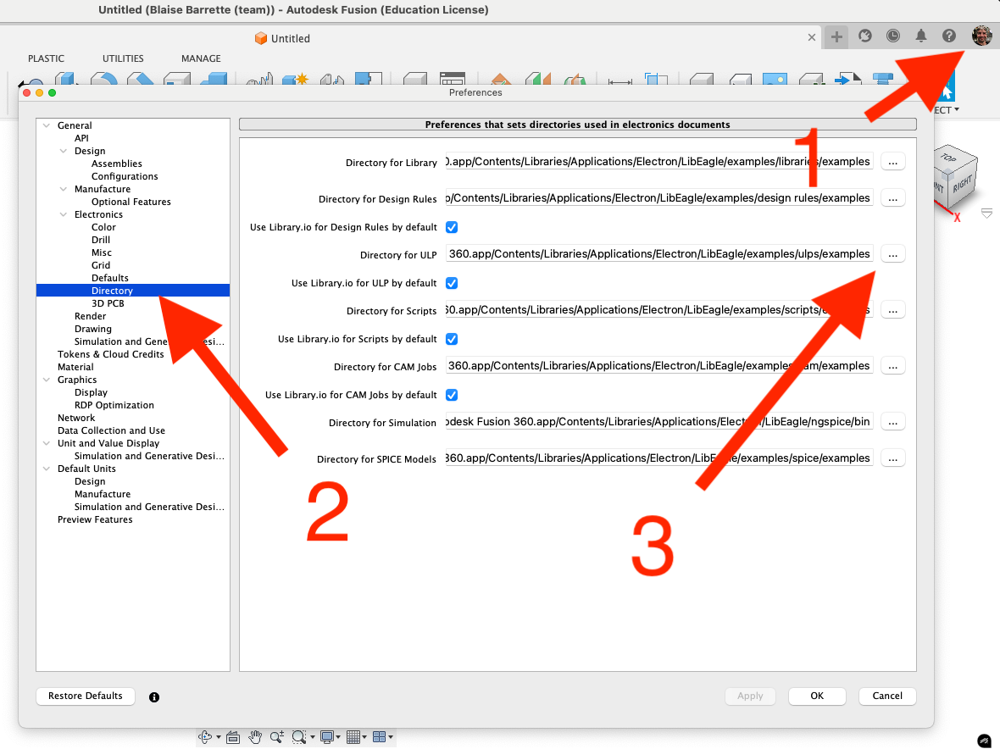

# QR Code Generator ULP for Fusion Electronics

A User Language Program (ULP) for generating QR codes directly on PCBs and schematics in Electronics Design, as well as footprint and symbols in the Electronics Library, in Autodesk Fusion Electronics / Eagle.

## Features

- QR code generation from URLs
- Automatic placement in the upper-left quadrant
- Support for multiple layers in 2D PCB and footprint:
  - Top Copper
  - Bottom Copper
  - Top Silkscreen
  - Bottom Silkscreen
  - Top Documentation
  - Bottom Documentation
  - Document
- Support for layers in Schematic:
  - Info
  - Documentation
- Support for layers in Symbol:
  - Symbol
  - Guide
  - Info
- Customizable size 250-5000 mils (0.25 to 5 inches)
- Cloud-based generation using python script hosted on PythonAnywhere
- Automatic version checking and updates notification
- Multi-language support:
  - English
  - French
  - German
  - Spanish
  - Italian
  - Japanese
  - Korean
  - Chinese
- No local installation required

## System Requirements

A computer Running MacOS or Windows with Fusion 360 installed.

## Installation

- Open Fusion 360
- Click on your profile icon in the top right corner
- Click on `Preferences`
- In the left panel, expand `Electronics` and click on `Directory`
- Find `Directory for ULPs` and click on the three dots
- Choose the folder where you want Fusion Electronics to find the ULPs
  - You can use the default folder if you want. Copy the path and place the ULP file there
  - Alternatively, I suggest creating a folder named `ULP` in your `Documents/Autodesk` directory
- You can uncheck `Use Library.io for ULP by default` if you want Fusion Electronics to use the ULP from your folder instead of the Library.io
- Download: [qrcode_generator.zip](https://github.com/blaisebarrette/QR-Code-generator-ULP-for-Fusion-electronic/releases/download/V1.1.0/qr_code_generator.zip)
- Place the ULP file in the `ULP` folder you chose in the previous step

That's it! The ULP is now available from Fusion Electronics!

## Usage

1. Open your 2D PCB or schematic in Electronics Design or a symbol or footprint in Electronics Library in Eagle/Fusion360 Electronics.
2. Click the `Run ULP` icon on the 2D PCB, schematic, footprint or symbol `AUTOMATE` toolbar.
3. In the ULP browser, select `qrcode_generator.
4. Double-click the selected ULP to execute it.
5. Alternatively, type `run` in the command line and press Enter to open the ULP browser.
6. You can also type `RUN qrcode_generator` in the command line and press Enter.
7. In the dialog box:
   - Input the URL for the QR code.
   - Specify the size in mils (1000 mils = 1 inch).
   - Choose the destination layer.

The QR code will be placed automatically in the upper-left quadrant of the origin.

## important

Important Note on URL Length:
Generating a QR code from a long URL increases its complexity. Highly complex QR codes may become difficult to scan if printed too small. If your PCB design has limited space for the QR code, consider using a service like <a href="http://bitly.com" target="_blank">bitly.com</a> to shorten the URL before generating the QR code. This reduces the code’s complexity, making it easier to scan when printed.

Example:

Here is a comparison between QR codes of different sizes, generated from long (left) and short (right) URLs:

## Technical Notes

- QR code is generated via a secure cloud service
- Minimum size: 250 mils (0.25 inch / 6.25 mm)
- Maximum size: 5000 mils (5 inch / 127 mm)
- Version checking ensures compatibility
- Automatic mirroring for bottom layers
- Language selection based on system settings

## Error Handling

The ULP includes comprehensive error handling for:
- Network connectivity issues
- API availability
- Version compatibility
- Invalid responses
- File operations

## Contributing

Contributions are welcome! Feel free to:
- Report bugs
- Suggest improvements
- Submit pull requests
- Add new language translations
- Add new features
- Improve error handling

## Version History

See [version_history.md](version_history.md) for complete version history and release notes.

## License

This project is licensed under the MIT License.

## Authors

- Blaise Barrette - Initial design and development

## Acknowledgments

- Thanks to <a href="https://github.com/lincolnloop/python-qrcode/tree/main">Pure python QR Code generator</a> for developping this great and easy to use library
- Thanks to the PythonAnywhere team for hosting the QR code generation service
- Thanks to the Eagle/Fusion360 community for feedback and suggestions
- Thanks to all contributors for language translations

## Little tap in the back!
<a href="https://buymeacoffee.com/blaisebarrette" target="_blank">Buy me a coffe!</a>
